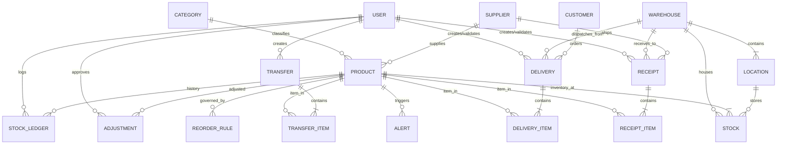

# 📦 STOCKSENSE
### **Intelligent Inventory Operations & Decision Support Platform**
*Developed for the Odoo × LPU National Hackathon*

---

> **"StockSense doesn't just record inventory. It understands inventory."**
> 
> *An enterprise-grade, modular, real-time platform that digitizes and streamlines inventory management, replacing manual ledgers and static spreadsheets with deterministic mathematical intelligence, 2D Digital Twin visualization, and an immutable audit trail.*

---

## 🌟 Executive Summary & Differentiators

Traditional ERP and inventory tracking systems function as passive ledgers that merely answer: *"What is my stock?"*

**StockSense** transforms warehouse operations into an active, intelligent decision-support system that answers:
- **"What is happening to my stock?"**
- **"Why did it happen?"** (Audit-grade continuous reconciliation)
- **"What will run out soon?"** (Deterministic lead-time mathematical forecast)
- **"What should I reorder, when, and how much?"**
- **"Where is inventory sitting across racks?"** (2D Digital Twin)
- **"What inventory is becoming risky or tying up capital?"** (Aging analysis)
- **"What urgent action should I take next?"** (Smart Daily Brief)

---

## 🚀 Key Differentiating Features

### 1. 🎯 Inventory Health Score (0–100)
A dynamic, explainable score updated in real-time across six operational factors:
* **Catalog Availability (+35 pts)**: Percentage of catalog with healthy stock
* **Low-Stock Risk (-15 pts)**: Penalty for items breaching safety thresholds
* **Stockout Penalty (-20 pts)**: Critical penalty for completely depleted items
* **Queue Friction (-10 pts)**: Overdue or bottlenecked receipts & deliveries
* **Adjustment Variance (-10 pts)**: Anomaly penalty from physical count corrections
* **Excess & Overstock (-10 pts)**: Penalty for capital trapped in excess holding
* *Clickable "Why is my Health X?" breakdown modal.*

### 2. 🧠 Smart Reorder Advisor
Deterministic, transparent calculations for every catalog product:
$$\text{Safety Stock} = \lceil \text{Daily Usage} \times \sqrt{\text{Lead Time}} \rceil$$
$$\text{Reorder Point} = (\text{Daily Usage} \times \text{Lead Time}) + \text{Safety Stock}$$
$$\text{Recommended Order Quantity} = \max(0, \text{Maximum Stock} - \text{Current Stock})$$
* **Risk Levels**: `SAFE` 🟢 | `WATCH` 🔵 | `AT RISK` 🟡 | `CRITICAL` 🔴
* *Transparent "Why?" button explains the step-by-step mathematical reasoning for each recommendation.*

### 3. 🔍 "Why Did Stock Change?" Continuous Reconciliation
Whenever an operator views a product, StockSense reconciles the exact continuous balance equation:
$$\text{Current Stock} = \text{Baseline} + \text{Receipts} - \text{Deliveries} \pm \text{Transfers} \pm \text{Adjustments}$$
*Eliminates the need to cross-examine dozens of separate invoices, packing slips, and adjustment slips.*

### 4. 🗺️ Inventory Digital Twin (2D Warehouse Grid)
Interactive 2D spatial layout for **Main Central Warehouse**, **Production & Assembly Plant**, and **Store Room Depot**:
* Real-time rack occupancy meters and color-coded status (🟢 `<70%`, 🟡 `70–90%`, 🔴 `>90%`)
* Interactive rack inspection drawer revealing stored SKUs, unit counts, and low-stock warnings.

### 5. ⏳ Stock Aging & Capital Lockup Analysis
Segments inventory into four aging tiers based on last activity:
* **Fresh (0–30 days)**: High liquidity active inventory
* **Aging (31–60 days)**: Moderate movement
* **Slow Moving (61–90 days)**: Sluggish demand velocity
* **Dead Stock (90+ days)**: Non-moving tied-up working capital ($)

### 6. 📈 AI-Assisted Demand Forecasting & Trend Modeling
* **90-Day Time-Series Historical Analysis**: Real inventory consumption profiles (Stable, Increasing, Decreasing, Seasonal, Irregular, Slow-Moving).
* **Deterministic Projections**: Weighted moving average and exponential smoothing modeling 30, 60, and 90-day consumption.
* **Explainable Math**: Complete breakdown showing daily velocity, historical variance, supplier lead times, and safety thresholds.
* **One-Click Reorder Intake**: Prefills vendor purchase receipt with recommended quantities and target warehouse.

### 7. 🤖 StockSense Copilot Floating Assistant
* **Natural-Language Guidance**: Step-by-step application walkthroughs (*"How do I create a receipt?"*, *"How do I transfer stock?"*) with direct action navigation buttons.
* **Real Database Answers**: Live queries of stock levels, upcoming stockouts, recent deliveries, and warehouse capacities with zero hallucination.
* **Safe Action Preparation**: Translates natural language requests (*"Transfer 20 steel rods from Main Warehouse to Production"*) into structured, pre-validated action cards requiring explicit user confirmation.

### 8. 🚨 Rule-Based Anomaly Detection Engine
* High-variance physical count adjustments ($>25\%$ or $\ge 10$ units)
* Outbound demand velocity spikes ($>2.5\times$ daily average)
* Blocked negative stock attempts during order fulfillment

### 9. ⚡ Global Command Center & Navigation
* Grouped enterprise hierarchy: `MAIN`, `INVENTORY`, `OPERATIONS`, `WAREHOUSES`, `INTELLIGENCE`, `REPORTS`, `SYSTEM`.
* Global **`+ Create`** Quick Action button in top header.

### 10. 📜 Immutable Stock Ledger
Continuous audit log with before/after global stock baselines, before/after location rack quantities, transaction timestamps, reference documents, user operator signatures, and **one-click CSV export**.

---

## 🏗️ System Architecture

```
┌────────────────────────────────────────────────────────────────────────┐
│                        STOCKSENSE FRONTEND                             │
│       React 18 • TypeScript • Vite • Tailwind CSS • Lucide • Recharts  │
│  ┌───────────────────────┬─────────────────────────┬─────────────────┐ │
│  │   Dashboard & KPIs    │   Operations Modules    │ Intelligence Hub│ │
│  │ (Daily Brief, Radar)  │ (Rec, Del, Trf, Adj)    │(Health, Reorder)│ │
│  └───────────────────────┴─────────────────────────┴─────────────────┘ │
└───────────────────────────────────▲────────────────────────────────────┘
                                    │ REST API (JWT Authenticated)
┌───────────────────────────────────▼────────────────────────────────────┐
│                        STOCKSENSE BACKEND                              │
│            Node.js • Express • TypeScript • Zod Validation             │
│  ┌─────────────────────────────────┬─────────────────────────────────┐ │
│  │       Core Stock Engine         │      Intelligence Engine        │ │
│  │ • Transactional Mutations       │ • Health Score (0-100)          │ │
│  │ • Immutable Ledger Logging      │ • Reorder Advisor Algorithm     │ │
│  │ • Insufficient Stock Validation │ • Anomaly Rule Detector         │ │
│  └─────────────────────────────────┴─────────────────────────────────┘ │
└───────────────────────────────────▲────────────────────────────────────┘
                                    │ Prisma ORM
┌───────────────────────────────────▼────────────────────────────────────┐
│                        DATABASE LAYER                                  │
│       SQLite (Zero-Config Default) / PostgreSQL Relational Schema      │
│   Users • Products • Stocks • Receipts • Deliveries • Transfers •      │
│   Adjustments • StockLedger • Warehouses • Locations • Alerts          │
└────────────────────────────────────────────────────────────────────────┘
```

---

## 📊 Database Relational Schema (ER Diagram)



---

## 💻 Tech Stack

| Layer | Technologies |
|---|---|
| **Frontend** | React 18, TypeScript, Vite, Tailwind CSS, Lucide React, Recharts |
| **Backend** | Node.js, Express, TypeScript, Zod, JWT, bcryptjs |
| **Database & ORM** | Prisma ORM, SQLite (`dev.db` zero-config) / PostgreSQL support |
| **Testing** | Jest, ts-jest, Supertest |
| **DevOps & Tooling** | tsx, Vite proxy, Docker Compose |

---

## 🛠️ Quickstart & Local Setup

### Prerequisites
* **Node.js**: v18+ (tested on Node v24)
* **npm**: v9+

### 1. Clone & Install Dependencies

```bash
# Clone the repository
cd c:/Users/vansh/Desktop/Odoo

# Install backend dependencies
cd backend
npm install

# Install frontend dependencies
cd ../frontend
npm install
```

### 2. Database Migration & Realistic Seeding

```bash
cd ../backend

# Generate Prisma Client and Push Relational Schema
npx prisma db push

# Seed 21 realistic products, 3 warehouses, suppliers, customers, and demo initial queues
npx tsx prisma/seed.ts
```

### 3. Run Automated Core Engine Tests

```bash
cd ../backend
npm test
```
*Output: 9/9 passing tests validating Receipts, Deliveries, Transfers, Adjustments, Ledger integrity, and Reorder Advisor calculations.*

### 4. Start the Application

In two separate terminals:

**Terminal 1 (Backend API - Port 5000):**
```bash
cd backend
npm run dev
```

**Terminal 2 (Frontend Web App - Port 3000):**
```bash
cd frontend
npm run dev
```

Open your browser and navigate to: **`http://localhost:3000/`**

---

## 🔑 Demo Personas & Credentials

| Role | Email | Password | Access Capabilities |
|---|---|---|---|
| **Inventory Manager** | `manager@stocksense.io` | `manager123` | Full access to all operations, intelligence, reorders, adjustments |
| **Administrator** | `admin@stocksense.io` | `admin123` | System settings, warehouse configuration, user management |
| **Warehouse Staff** | `staff@stocksense.io` | `staff123` | Dock receipt validation, pick/pack delivery fulfillment, rack transfers |

*Note: The login page includes **instant 1-click demo persona buttons** for immediate evaluator access without manual typing. Password reset supports **Demo OTP: `123456`**.*

---

## 🎬 Hackathon Live Demo Walkthrough Scenario

To demonstrate StockSense in under 3 minutes during your presentation:

1. Click the glowing **`Run Inventory Demo`** button in the top navigation bar.
2. **Step 0 (Baseline State)**: Observe **Steel Rods (12mm)** at `42 kg` (breaching the `50 kg` reorder threshold $\rightarrow$ Critical risk alert).
3. **Step 1 (Receipt)**: Click **Execute Step 1 (+100 kg)** from supplier Apex Steel. Total stock increases to `142 kg` and an immutable receipt ledger entry is written.
4. **Step 2 (Transfer)**: Click **Execute Step 2 (50 kg)** moving raw steel from *Main Warehouse Rack A* $\rightarrow$ *Production Plant Rack P1*. Observe total stock remaining invariant at `142 kg` while rack distributions update.
5. **Step 3 (Delivery)**: Click **Execute Step 3 (-20 kg)** fulfilling order to Apex Fabrication. Stock safely drops to `122 kg`.
6. **Step 4 (Adjustment)**: Click **Execute Step 4 (-3 kg)** logging inspection damaged stock with mandatory variance reason. Final stock reaches exactly `119 kg`.
7. **Verification**: Open product details for Steel Rods to view the automated equation:
   $$\text{Baseline } 42\text{ kg} + \text{Receipts } 100\text{ kg} - \text{Deliveries } 20\text{ kg} - \text{Adjustments } 3\text{ kg} = 119\text{ kg} \quad (\text{Net } +77\text{ kg})$$

---

## 🔌 Core API Endpoints

### Authentication
* `POST /api/auth/register` - Create user
* `POST /api/auth/login` - Authenticate & receive JWT
* `GET /api/auth/me` - Active session profile
* `POST /api/auth/forgot-password` - Request demo OTP (`123456`)
* `POST /api/auth/reset-password` - Reset password with OTP

### Operations
* `GET /api/products` - Filtered product catalog with stock counts
* `POST /api/products` - Create catalog item
* `GET /api/products/:id` - Product overview & stock by location
* `GET /api/receipts` - Inbound receipts queue
* `POST /api/receipts` - Schedule vendor shipment
* `POST /api/receipts/:id/validate` - **Transactional dock intake**
* `GET /api/deliveries` - Outbound delivery orders
* `POST /api/deliveries` - Create customer order
* `POST /api/deliveries/:id/validate` - **Transactional dispatch validation**
* `GET /api/transfers` - Internal movement orders
* `POST /api/transfers/:id/complete` - **Execute location rebalancing**
* `GET /api/adjustments` - Physical count adjustment logs
* `POST /api/adjustments` - **Record adjustment with required reason**
* `GET /api/ledger` - Immutable stock movements transaction log
* `GET /api/ledger/export` - Download ledger as CSV

### Intelligence & Reports
* `GET /api/intelligence/health` - 0–100 Inventory Health score & factor breakdown
* `GET /api/intelligence/reorder` - Deterministic Reorder Advisor recommendations
* `GET /api/intelligence/risk` - Multi-dimensional risk matrix
* `GET /api/intelligence/aging` - 0–30d, 31–60d, 61–90d, 90+d aging analysis
* `GET /api/intelligence/anomalies` - Rule-based anomaly feed
* `GET /api/intelligence/daily-brief` - Prioritized top actions
* `GET /api/intelligence/explain/:productId` - Continuous stock balance reconciliation
* `GET /api/warehouses` - 2D Digital Twin facility layouts
* `GET /api/reports/summary` - Financial asset valuation & margins

---

## 🛡️ Data Consistency & Security Guarantees
1. **Zero Negative Stock**: Order validation strictly blocks dispatches exceeding location inventory.
2. **ACID Transaction Isolation**: All mutations use `prisma.$transaction` to guarantee atomic ledger and stock sync.
3. **Mandatory Adjustment Reasoning**: Physical counts cannot be altered without an audit variance reason.
4. **Immutable Ledger**: Transactions are append-only.
5. **Role-Based Authorization**: `ADMIN`, `INVENTORY_MANAGER`, and `WAREHOUSE_STAFF` separation.

---

## 🔮 Future Roadmap
- **RFID & Barcode Scanner Mode**: Hardware integration for mobile camera barcode scanning at receiving docks.
- **Automated Purchase Order Dispatch**: Direct webhook triggering of vendor POs when stock hits reorder point.
- **3D Spatial Digital Twin**: Three.js 3D isometric warehouse traversal.

---

## 👥 Hackathon Submission Details
- **Project**: StockSense - Intelligent Inventory Operations Platform
- **Event**: Odoo × LPU National Hackathon
- **Status**: Complete, Verified, Test Suite Passed, Demo-Ready!
